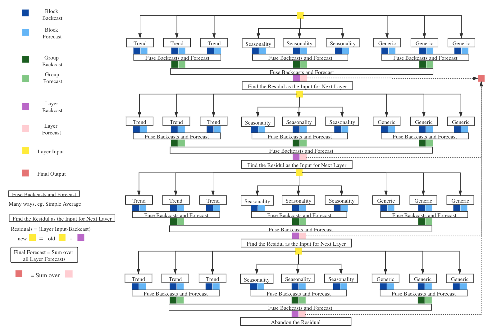

# Group-tsg

Model: 

The definition of blocks of differnet types and backcast, forecast residual mechanism is the same with paper [N-BEATS](https://arxiv.org/abs/1905.10437)

Dataset: Tourism
<<<<<<< HEAD

=======
>>>>>>> 8e70b6a773c5d0dacf9522d0cc46b6a2a8caa22b
